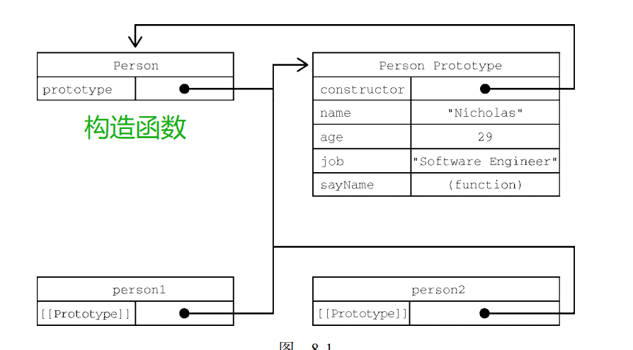
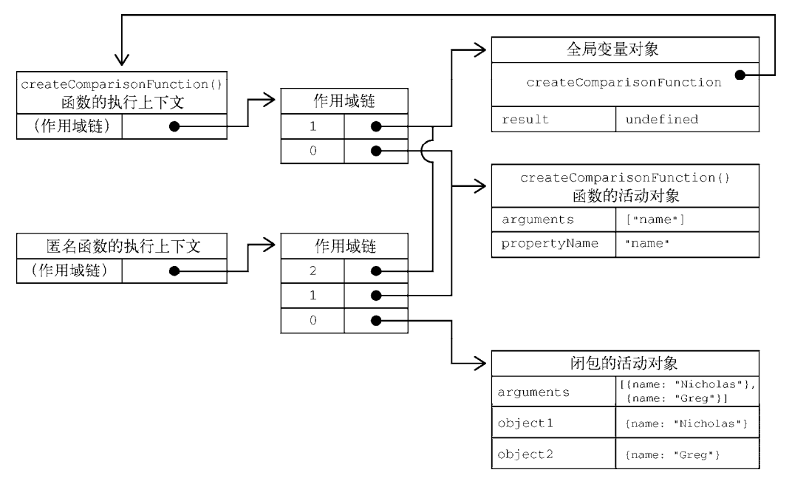

# Javascript基础
`注：主要参考红宝书第四版总结而成`
## 变量、作用域与内存
### 变量
+ js变量为松散类型
+ 可以包含两种不同类型的数据：原始值和引用值。原始值（primitive value）就是最简单的数据，引用值（reference value）则是由多个（原始值）值构成的对象。
+ 原始值包含6种类型：undefined,null,number,string,boolean,symbol(es6新增)；引用值就是Object。
+ typeof操作符可以用来判断原始值的类型，需要注意的是null的操作结果为object。此外，typeof操作符对判断引用值的意义不大，应该使用instanceof操作符
### 执行上下文与作用域
+ 执行上下文（以下简称“上下文”）的概念在 JavaScript 中是颇为重要的。变量或函数的上下文决定了它们可以访问哪些数据，以及它们的行为。每个上下文都有一个 ***关联的变量对象（variable object）*** ，而这个上下文中定义的所有变量和函数都存在于这个对象上。虽然无法通过代码访问变量对象，但后台处理数据会用到它。上下文在其所有代码都执行完毕后会被销毁，包括定义在它上面的所有变量和函数
+ 每个函数调用都有自己的上下文。当代码执行流进入函数时，函数的上下文被推到一个上下文栈上。在函数执行完之后，上下文栈会弹出该函数上下文，将控制权返还给之前的执行上下文。ECMAScript程序的执行流就是通过这个上下文栈进行控制的。
+ 上下文中的代码在执行的时候，会创建 ***变量对象*** 的一个作用域链（scope chain）。这个作用域链决定了各级上下文中的代码在访问变量和函数时的顺序。代码正在执行的上下文的 ***变量对象*** 始终位于作用域链的最前端。如果上下文是函数，则其 **活动对象（activation object）** 用作 ***变量对象*** 。活动对象最初只有一个定义变量：arguments。（全局上下文中没有这个变量。）作用域链中的下一个变量对象来自包含上下文，再下一个对象来自再下一个包含上下文。以此类推直至全局上下文；全局上下文的变量对象始终是作用域链的最后一个变量对象。

```
注：函数参数被认为是当前上下文中的变量，因此也跟上下文中的其他变量遵循相同的访问规则。
```
### 作用域链增强
虽然执行上下文主要有全局上下文和函数上下文两种（eval()调用内部存在第三种上下文），但有其他方式来增强作用域链。某些语句会导致在作用域链前端临时添加一个上下文，这个上下文在代码执行后会被删除。通常在两种情况下会出现这个现象，即代码执行到下面任意一种情况时：
+ try/catch 语句的 catch 块
+ with 语句

这两种情况下，都会在作用域链前端添加一个变量对象。对 with 语句来说，会向作用域链前端添加指定的对象；对 catch 语句而言，则会创建一个新的变量对象，这个变量对象会包含要抛出的错误对象的声明。
### 变量声明
ES6 之后，JavaScript 的变量声明经历了翻天覆地的变化。直到 ECMAScript 5.1，var 都是声明变量的唯一关键字。ES6 不仅增加了 let 和 const 两个关键字，而且还让这两个关键字压倒性地超越 var成为首选。
1. var. 在使用var声明变量时，该变量会被自动添加到最接近的上下文中。在函数中，最接近的上下文就是函数的局部上下文。如果变量未经声明就被初始化了，那么它就会自动被添加到全局上下文（严格模式下会报错）。
var声明会被拿到函数或者全局作用域的顶部，位于当前作用域所有代码之前。这个现象叫做变量提升（hoisting)。提升让同一作用域中的代码不必考虑变量是否已经声明就可以直接使用。
2. let. ES6 新增的 let 关键字跟 var 很相似，但它的作用域是块级的，**这也是 JavaScript 中的新概念**。此处说明块级作用域是es6新增的。let 与 var 的另一个不同之处是在同一作用域内不能声明两次。重复的 var 声明会被忽略，而重复的 let 声明会抛出 SyntaxError。
3. const. const声明关键字同样是ea6新增的，使用const声明变量时必须同时进行初始化，并且声明后不能对值进行更改，其实也就是常量。注意：const 声明只应用到顶级原语或者对象。换句话说，赋值为对象的 const 变量不能再被重新赋值为其他引用值，但对象的键则不受限制。如果想让整个对象都不能修改，可以使用 Object.freeze()，这样再给属性赋值时虽然不会报错，但会静默失败。
```
const的被提倡使用的原因：JavaScript 运行时编译器可以将其所有实例都替换成实际的值，而不会通过查询表进行变量查找，V8引擎就有这种优化。
```
### 垃圾回收
1. 垃圾回收的两种方法：1、标记清理（常用），2、引用计数（不常用）
2. 引用计数的缺点：循环引用
3. 基于垃圾回收机制的内存管理及性能优化：
+ 如果数据不再必要，那么把它设置为 null，从而释放其引用。这也可以叫作解除引用。
+ 使用let与const代替var。因为 const和let都以块（而非函数）为作用域，所以相比于使用 var，使用这两个新关键字可能会更早地让垃圾回收程序介入，尽早回收应该回收的内存。
+ 隐藏类和删除操作
4. 内存泄漏：a)意外声明全局变量：只要window不被清除，该变量就一直存在；b)闭包

## 基本引用类型
### Date
略。Date类型比较简单，使用场景也很固定，不浪费时间。
### RegExp正则表达式
语法：` let expression = /pattern/flag`
#### 匹配模式标记flag
1. g：全局模式，表示查找字符串的全部内容，而不是找到第一个匹配的内容就结束。
2. i：不区分大小写，表示在查找匹配时忽略 pattern 和字符串的大小写。
3. m：多行模式，表示查找到一行文本末尾时会继续查找。
4. y：粘附模式，表示只查找从 lastIndex 开始及之后的字符串。
5. u：Unicode 模式，启用 Unicode 匹配。
6. s：dotAll 模式，表示元字符.匹配任何字符（包括\n 或\r）。
#### 正则表达式中的元字符
`( [ { \ ^ $ | ) ] } ? * + .`
元字符在正则表达式中都有一种或多种特殊功能，所以要匹配上面这些字符本身，就必须使用反斜杠\来转义。
#### 使用构造函数创建正则表达式
`let expression = new RegExp("pattern", flag);`
注意，RegExp 构造函数的两个参数都是字符串。因为 RegExp 的模式参数是字符串，所以在某些情况下需要二次转义。所有元字符都必须二次转义，包括转义字符序列，如\n（\转义后的字符串是\\，在正则表达式字符串中则要写成\\\\）。
#### RegExp的实例方法
1. exec()：该方法主要用于配合捕获组使用，方法只接收一个参数，即要应用模式的字符串。如果找到了匹配项，则返回包含第一个匹配信息的数组；如果没找到匹配项，则返回null。返回的数组虽然是 Array 的实例，但包含两个额外的属性：index 和 input。index 是字符串中匹配模式的起始位置，input 是要查找的字符串。这个数组的第一个元素是匹配整个模式的字符串，其他元素是与表达式中的捕获组匹配的字符串。如果模式中没有捕获组，则数组只包含一个元素。
2. test()：接收一个字符串参数。如果输入的文本与模式匹配，则参数返回 true，否则返回 false。这个方法适用于只想测试模式是否匹配，而不需要实际匹配内容的情况。
### 原始值包装类型
为了方便操作原始值，ECMAScript 提供了 ***3 种特殊的引用类型：Boolean、Number 和 String***。
每当用到某个原始值的方法或属性时，后台都会创建一个相应原始包装类型的对象，从而暴露出操作原始值的各种方法。以字符串为例，在以读模式访问字符串值的任何时候，后台都会执行以下 3 步：
1. 创建一个 String 类型的实例；
2. 调用实例上的特定方法；
3. 销毁实例。（将其置为null）
boolean与number类型也是一样。
## 集合引用类型
### Object

### Array
`数组在面试中还是比较重要的`
+ 检测数组：Array.isArray()
+ 迭代器方法：keys()、values()和entries()
+ from()和of()。from()用于将类数组结构转换为数组实例，而 of()用于将一组参数转换为数组实例。
+ 栈、队列方法：push(),pop(),shift()。
+ concat()、slice()、splice()
+ 搜索方法：ECMAScript 提供了 3 个严格相等的搜索方法：indexOf()、lastIndexOf()和 includes()
+ 断言方法：find()和 findIndex()
+ 归并方法：reduce()、reduceRight()
+ 迭代方法:
1. map()：对数组每一项都运行传入的函数，返回由每次函数调用的结果构成的数组。
2. forEach()：对数组每一项都运行传入的函数，没有返回值。
3. filter()：对数组每一项都运行传入的函数，函数返回 true 的项会组成数组之后返回。
4. every()：对数组每一项都运行传入的函数，如果对每一项函数都返回 true，则这个方法返回 true。
5. some()：对数组每一项都运行传入的函数，如果有一项函数返回 true，则这个方法返回 true。

### Map
#### Map与Object的不同点
1. Object的键只能使用字符串、数值或Symbol，Map则可以使用任何JS数据类型来作为键。Map 内部使用 SameValueZero 比较操作（ECMAScript 规范内部定义，语言中不能使用），基本上相当于使用严格对象相等的标准来检查键的匹配性。与 Object 类似，映射的值是没有限制的。
```
注意 SameValueZero 是 ECMAScript 规范新增的相等性比较算法。关于 ECMAScript 的相等性比较，可以参考 MDN 文档中的文章“Equality Comparisons and Sameness”。
```
2. Map 实例会维护键值对的插入顺序，因此可以根据插入顺序执行迭代操作。映射实例可以提供一个迭代器（Iterator），能以插入顺序生成[key, value]形式的数组。可以通过 entries()方法（或者 Symbol.iterator 属性，它引用 entries()）取得这个迭代器。
3. 内存占用：不同浏览器的情况不同，但给定固定大小的内存，Map 大约可以比 Object 多存储 50%的键/值对。
4. 插入性能：向 Object 和 Map 中插入新键/值对的消耗大致相当，不过插入 Map 在所有浏览器中一般会稍微快一点儿。对这两个类型来说，插入速度并不会随着键/值对数量而线性增加。如果代码涉及大量插入操作，那么显然 Map 的性能更佳。
5. 查找速度：与插入不同，从大型 Object 和 Map 中查找键/值对的性能差异极小，但如果只包含少量键/值对，则 Object 有时候速度更快。如果代码涉及大量查找操作，那么某些情况下可能选择 Object 更好一些。
6. 删除性能：使用 delete 删除 Object 属性的性能一直以来饱受诟病，目前在很多浏览器中仍然如此。为此，出现了一些伪删除对象属性的操作，包括把属性值设置为 undefined 或 null。但很多时候，这都是一种讨厌的或不适宜的折中。而对大多数浏览器引擎来说，Map 的 delete()操作都比插入和查找更快。如果代码涉及大量删除操作，那么毫无疑问应该选择 Map。
**综合来看，map性能优于object**
#### Map的常用API
1. set()
2. get()
3. has()
4. delete()
5. clear()
6. keys()
7. values()
8. entries()

### WeakMap
WeakMap与Map的差异点：
1. WeakMap中的键只能是 Object 或者继承自 Object 的类型，尝试使用非对象设置键会抛出TypeError。值的类型没有限制。
2. WeakMap 中“weak”表示弱映射的键是“弱弱地拿着”的。意思就是，这些键不属于正式的引用，不会阻止垃圾回收。但要注意的是，弱映射中值的引用可不是“弱弱地拿着”的。只要键存在，键/值对就会存在于映射中，并被当作对值的引用，因此就不会被当作垃圾回收。
3. 不可迭代。因为 WeakMap 中的键/值对任何时候都可能被销毁，所以没必要提供迭代其键/值对的能力。
`除了以上3点，WeakMap与Map的API基本一致`
```
WeakMap 实例之所以限制只能用对象作为键，是为了保证只有通过键对象的引用才能取得值。如果允许原始值，那就没办法区分初始化时使用的字符串字面量和初始化之后使用的一个相等的字符串了。
```

### Set与WeakSet
ECMAScript 6 新增的 Set 是一种新集合类型，在很多方面都像是加强的 Map，它们的大多数 API 和行为都是共有的。
WeakSet与Set的关系和WeakMap与Map的关系一致

## 迭代器（Iterator）与生成器（Generator)
迭代器与生成器都是ES6新增的特性，使用这两个特性，能够更清晰、高效、方便地实现迭代。
### 迭代器模式
迭代器模式（特别是在 ECMAScript 这个语境下）描述了一个方案，即可以把有些结构称为“可迭代对象”（iterable），因为它们实现了正式的 Iterable 接口，而且可以通过迭代器 Iterator 消费。
#### 可迭代协议
实现 Iterable 接口（可迭代协议）要求同时具备两种能力：支持迭代的自我识别能力和创建实现Iterator 接口的对象的能力。在 ECMAScript 中，这意味着必须暴露一个属性作为“默认迭代器”，而且这个属性必须使用特殊的 Symbol.iterator 作为键。这个默认迭代器属性必须引用一个迭代器工厂函数，调用这个工厂函数必须返回一个新迭代器。
### 生成器
1. 生成器的形式是一个函数，函数名称前面加一个星（*）表示它是一个生成器。
2. 调用生成器函数会产生一个生成器对象。生成器对象一开始处于暂停执行（suspended）的状态。与迭代器相似，生成器对象也实现了 Iterator 接口，因此具有 next()方法。调用这个方法会让生成器开始或恢复执行。
3. next()方法的返回值类似于迭代器，有一个 done 属性和一个 value 属性。函数体为空的生成器函数中间不会停留，调用一次 next()就会让生成器到达 done: true 状态。
4. yield 关键字可以让生成器停止和开始执行，也是生成器最有用的地方。生成器函数在遇到 yield关键字之前会正常执行。遇到这个关键字后，执行会停止，函数作用域的状态会被保留。停止执行的生成器函数只能通过在生成器对象上调用 next()方法来恢复执行。yield 关键字只能在生成器函数内部使用，用在其他地方会抛出错误。类似函数的 return 关键字，yield 关键字必须直接位于生成器函数定义中，出现在嵌套的非生成器函数中会抛出语法错误。
5. 除了可以作为函数的中间返回语句使用，yield 关键字还可以作为函数的中间参数使用。上一次让生成器函数暂停的 yield 关键字会接收到传给 next()方法的第一个值。这里有个地方不太好理解——第一次调用 next()传入的值不会被使用，因为这一次调用是为了开始执行生成器函数。
```
箭头函数不能用来定义生成器函数。
```
## 对象、类与面向对象编程
ECMA-262 将对象定义为一组属性的无序集合。严格来说，这意味着对象就是一组没有特定顺序的值。
### 理解对象
#### 对象的创建方式
```
let obj = New Object();
let obj = {};
```
#### 属性的类型
属性分两种：数据属性和访问器属性。
##### 数据属性
数据属性包含一个保存数据值的位置。值会从这个位置读取，也会写入到这个位置。数据属性有 4
个特性描述它们的行为。
1. Configurable：表示属性是否可以通过 delete 删除并重新定义，是否可以修改它的特性，以及是否可以把它改为访问器属性。默认情况下，所有直接定义在对象上的属性的这个特性都是 true。此外，一个属性被定义为不可配置之后，就不能再变回可配置的了。再次调用 Object.defineProperty()并修改任何非 writable 属性会导致错误。
2. Enumerable：表示属性是否可以通过 for-in 循环返回。默认情况下，所有直接定义在对象上的属性的这个特性都是 true。
3. Writable：表示属性的值是否可以被修改。默认情况下，所有直接定义在对象上的属性的这个特性都是 true。
4. Value：包含属性实际的值。这就是前面提到的那个读取和写入属性值的位置。这个特性的默认值为 undefined。
要修改属性的默认特性，就必须使用 Object.defineProperty()方法。用法如下：
```javascript
let person = {}; 
Object.defineProperty(person, "name", { 
 writable: false, 
 value: "Nicholas" 
});
```
##### 访问器属性
访问器属性不包含数据值。相反，它们包含一个获取（getter）函数和一个设置（setter）函数，不过这两个函数不是必需的。在读取访问器属性时，会调用获取函数，这个函数的责任就是返回一个有效的值。在写入访问器属性时，会调用设置函数并传入新值，这个函数必须决定对数据做出什么修改。访问器属性有 4 个特性描述它们的行为：
1. Configurable：表示属性是否可以通过 delete 删除并重新定义，是否可以修改它的特性，以及是否可以把它改为数据属性。默认情况下，所有直接定义在对象上的属性的这个特性都是 true。
2. Enumerable：表示属性是否可以通过 for-in 循环返回。默认情况下，所有直接定义在对象上的属性的这个特性都是 true。
3. Get：获取函数，在读取属性时调用。默认值为 undefined。
4. Set：设置函数，在写入属性时调用。默认值为 undefined。

访问器属性是不能直接定义的，必须使用 Object defineProperty()。下面是一个例子：
```javascript
let book = { 
 year_: 2017, 
 edition: 1
}; 
Object.defineProperty(book, "year", { 
 get() { 
    return this.year_; 
 }, 
 set(newValue) { 
    if (newValue > 2017) { 
        this.year_ = newValue; 
        this.edition += newValue - 2017; 
    } 
 } 
}); 
book.year = 2018; 
console.log(book.edition); // 2
```
获取函数和设置函数不一定都要定义。只定义获取函数意味着属性是只读的，尝试修改属性会被忽略。在严格模式下，尝试写入只定义了获取函数的属性会抛出错误。类似地，只有一个设置函数的属性是不能读取的，非严格模式下读取会返回 undefined，严格模式下会抛出错误。
#### 重要方法
1. Object.defineProperty(obj, propName, configObj).
2. Object.definePropertied(obj, configObj).
3. Object.getOwnPropertyDescriptor(obj, propName).
3. Object.getOwnPropertyDescriptor(obj).
5. Object.assign(targetObj, sourceObj):这个方法接收一个目标对象和一个或多个源对象作为参数，然后将每个源对象中可枚举（Object.propertyIsEnumerable()返回 true）和自有（Object.hasOwnProperty()返回 true）属性复制到目标对象。以字符串和符号为键的属性会被复制。对每个符合条件的属性，这个方法会使用源对象上的Get取得属性的值，然后使用目标对象上的Set设置属性的值。Object.assign()实际上对每个源对象执行的是浅复制。如果多个源对象都有相同的属性，则使用最后一个复制的值。此外，从源对象访问器属性取得的值，比如获取函数，会作为一个静态值赋给目标对象。换句话说，不能在两个对象间转移获取函数和设置函数。如果赋值期间出错，则操作会中止并退出，同时抛出错误。Object.assign()没有“回滚”之前赋值的概念，因此它是一个尽力而为、可能只会完成部分复制的方法。
6. Object.is().
### 创建对象
#### 1.工厂模式
#### 2.构造函数模式
使用构造函数创建对象时，要使用new操作符。此时会进行以下步骤：
1. 在内存中创建一个新对象。
2. 这个新对象内部的[[Prototype]]特性被赋值为构造函数的 prototype 属性。
3. 构造函数内部的 this 被赋值为这个新对象（即 this 指向新对象）。
4. 执行构造函数内部的代码（给新对象添加属性）。
5. 如果构造函数返回非空对象，则返回该对象；否则，返回刚创建的新对象。
```
constructor 本来是用于标识对象类型的。不过，一般认为 instanceof 操作符是确定对象类型更可靠的方式。这是因为constructor可能会被手动修改指向。
```
#### 3.原型模式
每个函数都会创建一个 prototype 属性，这个属性是一个对象，包含应该由特定引用类型的实例共享的属性和方法。实际上，这个对象就是通过调用构造函数创建的对象的原型。使用原型对象的好处是，在它上面定义的属性和方法可以被对象实例共享。原来在构造函数中直接赋给对象实例的值，可以直接赋值给它们的原型。
##### 理解原型
无论何时，只要创建一个函数，就会按照特定的规则为这个函数创建一个 prototype 属性（指向原型对象）。默认情况下，所有原型对象自动获得一个名为 constructor 的属性，指回与之关联的构造函数。对前面的例子而言，Person.prototype.constructor 指向 Person。

我来捋一下构造函数、原型对象与实例对象之间的关系：
1. 只要创建了一个构造函数（Person），那么就会对应存在了一个原型对象（通过Person.prototype引用），通过Object.getOwnPropertyDescriptors(Person)可以拿到该prototype属性。
2. 这个通过Person.prototype引用的原型对象上有一个constructor属性，它就指向构造函数Person。
3. 原型对象Person.prototype与实例person1的关系是
```js
Person.prototype.isPrototypeOf(person1)// true
Object.getPrototypeOf(person1) === Person.prototype // true，标准
person1.__proto__ === Person.prototype // true,非标准
```
此外，Object 类型还有一个 setPrototypeOf()方法，可以向实例的私有特性\[[Prototype]]写入一个新值。这样就可以重写一个对象的原型继承关系。
##### 原型链
+ 如何判断某个实例的属性是本身的还是原型链上的？1.person1.hasOwnProperty(propName)2.Object.getOwnPropertyDescriptor(person1,propName)
+ in操作符：有两种方式使用 in 操作符：单独使用和在 for-in 循环中使用。
在单独使用时，in 操作符会在可以通过对象访问指定属性时返回 true，无论该属性是在实例上还是在原型上。
`通过in操作判断为true，而hasOwnProperty()结果为false，两者结合可知该属性是在原型对象上而不在其本身。`
在 for-in 循环中使用 in 操作符时，可以通过对象访问且可以被枚举的属性都会返回，包括实例属性和原型属性。
+ 其他方法：
1. Object.getOwnPropertyNames():对象上所有可枚举的实例字符串数字属性
2. Object.getOwnPropertySymbols()：对象上所有可枚举的实例Symbol属性
3. Object.keys():对象上所有可枚举的 **实例**属性
### 继承
ECMA-262 把原型链定义为 ECMAScript 的主要继承方式。
### 类
类是ECMAScript 中新的基础性语法糖结构，实际上它背后使用的仍然是原型和构造函数的概念。
#### 类定义
+ 方式：类声明与类定义
+ 与构造函数方式的不同之处是不存在变量提升
+ 类构成：类可以包含构造函数方法、实例方法、静态类方法、获取函数、设置函数，es6中不支持在类块中定义原型数据（除了函数），但能在外面手动添加。
`注意：es6还不能定义静态属性`
#### 类构造函数
+ 类构造函数默认情况下会返回this对象，如果返回的不是this对象，而是其他不相关的对象，那么this对象会被垃圾清理，返回的对象使用instanceof操作符也检测不出跟类有任何的关系。
+ 调用类构造函数必须要使用new操作符，否则会抛出TypeError错误。
+ 实例化之后，类构造函数会成为普通的实例方法，可以通过实例调用。
+ 使用typeof一个类，会发现返回的是function，这表明它本质上还是函数，只是一个语法糖。

使用 new 调用类的构造函数会执行如下操作：
1. 在内存中创建一个新对象。
2. 这个新对象内部的\[[Prototype]]指针被赋值为构造函数的 prototype 属性。
3. 构造函数内部的 this 被赋值为这个新对象（即 this 指向新对象）。
4. 执行构造函数内部的代码（给新对象添加属性）。
5. 如果构造函数返回非空对象，则返回该对象；否则，返回刚创建的新对象。
`可以对比使用构造函数创建对象时的操作对比来看。`
#### 实例、原型和类成员
类的语法可以非常方便地定义应该存在于实例上的成员、应该存在于原型上的成员，以及应该存在于类本身的成员。
+ 定义类成员可以在构造函数中添加，也可以在类块外添加（Person.name = ''）。
+ 定义原型成员可以在类块内部、构造函数外部添加，或者在类块外部添加（Person.prototype.name = ''）。也就是说，**在类块上添加的成员实际上是添加到了原型上面了**。
+ 类定义也支持获取和设置访问器。语法与行为跟普通对象一样：
```js
class Person { 
 set name(newName) { 
  this.name_ = newName; 
 } 
 get name() { 
  return this.name_; 
 } 
}
```
+ 静态类方法（无需存在实例）：在实例方法前加关键字static即静态方法
+ 类定义语法支持在原型和类本身上定义生成器方法，因为支持生成器方法，所以可以通过添加一个默认的迭代器，把类实例变成可迭代对象：
```js
class Person { 
 constructor() { 
 this.nicknames = ['Jack', 'Jake', 'J-Dog']; 
 } 
 *[Symbol.iterator]() { 
 yield *this.nicknames.entries(); 
 } 
}
let p = new Person(); 
for (let [idx, nickname] of p) { 
 console.log(nickname); 
}
// Jack 
// Jake 
// J-Dog
```
### 类继承
ECMAScript 6 新增特性中最出色的一个就是原生支持了类继承机制。虽然类继承使用的是新语法，但背后依旧使用的是原型链。
#### super
1. super 只能在派生类构造函数和静态方法中使用
2. 不能单独引用 super 关键字，要么用它调用构造函数，要么用它引用静态方法。
3. 调用 super()会调用父类构造函数，并将返回的实例赋值给 this。
4. super()的行为如同调用构造函数，如果需要给父类构造函数传参，则需要手动传入。
5. 如果没有定义类构造函数，在实例化派生类时会调用 super()，而且会传入所有传给派生类的参数。
6. 在类构造函数中，不能在调用 super()之前引用 this。
7. 如果在派生类中显式定义了构造函数，则要么必须在其中调用 super()，要么必须在其中返回一个对象。

## 函数
定义函数的四种方式：
1. 函数声明。即 function func(){}
2. 函数表达式。即 let func = function(){};
3. 箭头函数
4. Function对象。即 let func = New Function(funcName, params, funcBody);
### 箭头函数
+ 箭头函数不能使用 arguments、super 和new.target，也不能用作构造函数。此外，箭头函数也没有 prototype 属性。

### js函数没有重载
在其他语言比如 Java 中，一个函数可以有两个定义，只要签名（接收参数的类型和数量）不同就行。ECMAScript 函数没有签名，因为参数是由包含零个或多个值的数组表示的。没有函数签名，自然也就没有重载。第二个定义会覆盖前一个定义。
### 函数参数
#### 暂时性死区
**参数初始化顺序遵循“暂时性死区”规则，即前面定义的参数不能引用后面定义的。**
#### 参数扩展
参数扩展特性应用在函数调用时。例如
```js
function getSum() { 
 let sum = 0; 
 for (let i = 0; i < arguments.length; ++i) { 
 sum += arguments[i]; 
 } 
 return sum; 
}
const arr = [1,2,3,4]
getSun(...arr); //函数调用时使用
```
#### 参数收集
参数收集特性应用在函数定义时，例如
```js
function getSum(...values) { 
 // 顺序累加 values 中的所有值
 // 初始值的总和为 0 
 return values.reduce((x, y) => x + y, 0); 
}
console.log(getSum(1,2,3)); // 6
```
`箭头函数支持函数参数扩展与参数收集`
### 函数声明与函数表达式
JavaScript 引擎在加载数据时对它们是区别对待的。JavaScript 引擎在任何代码执行之前，会先读取函数声明，并在执行上下文中
生成函数定义。而函数表达式必须等到代码执行到它那一行，才会在执行上下文中生成函数定义。
函数声明会在任何代码执行之前先被读取并添加到执行上下文。这个过程叫作函数声明提升（function declaration hoisting）
除此以外，函数声明与函数表达式是一样的。
### 函数作为值
因为函数名在 ECMAScript 中就是变量，所以函数可以用在任何可以使用变量的地方。这意味着不仅可以把函数作为参数传给另一个函数，而且还可以在一个函数中返回另一个函数。
### 函数内部
在 ECMAScript 5 中，函数内部存在两个特殊的对象：arguments 和 this。ECMAScript 6 又新增了 new.target 属性。
#### arguments
arguments是一个类数组对象，包含调用函数时传入的所有参数。这个对象只有以 function 关键字定义函数（相对于使用箭头语法创建函数）时才会有。虽然主要用于包含函数参数，但 arguments 对象其实还有一个 callee 属性，是一个指向 arguments 对象所在函数的指针。来看下面这个经典的阶乘函数：
```js
function factorial(num) { 
 if (num <= 1) { 
 return 1; 
 } else { 
 return num * factorial(num - 1); 
 } 
}
```
这个函数要正确执行就必须保证函数名是 factorial，从而导致了紧密耦合。使用 arguments.callee 就可以让函数逻辑与函数名解耦：
```js
function factorial(num) { 
 if (num <= 1) { 
 return 1; 
 } else { 
 return num * arguments.callee(num - 1); 
 } 
}
```
#### this
另一个特殊的对象是 this，它在标准函数和箭头函数中有不同的行为。
在标准函数中，this 引用的是把函数当成方法调用的上下文对象，这时候通常称其为 this 值（在网页的全局上下文中调用函数时，this 指向 windows）。
在箭头函数中，this引用的是定义箭头函数的上下文。
在事件回调或定时回调中调用某个函数时，this 值指向的并非想要的对象。此时将回调函数写成箭头函数就可以解决问题。这是因为箭头函数中的 this 会保留定义该函数时的上下文。
#### new.target
ECMAScript 中的函数始终可以作为构造函数实例化一个新对象，也可以作为普通函数被调用。ECMAScript 6 新增了检测函数是否使用 new 关键字调用的 new.target 属性。如果函数是正常调用的，则 new.target 的值是 undefined；如果是使用 new 关键字调用的，则 new.target 将引用被调用的构造函数。
### 函数属性与方法
函数是对象，因此有属性和方法。
每个函数都有两个属性：length和 prototype。其中，length 属性保存函数定义的命名参数的个数，。prototype 是保存引用类型所有实例方法的地方，这意味着 toString()、valueOf()等方法实际上都保存在 prototype 上，进而由所有实例共享。
函数还有两个方法：apply()和 call()。这两个方法都会以指定的 this 值来调用函数，即会设置调用函数时函数体内 this 对象的值。apply()方法接收两个参数：函数内 this 的值和一个参数数组。第二个参数可以是 Array 的实例，但也可以是 arguments 对象。call()方法与 apply()的作用一样，只是传参的形式不同。第一个参数跟 apply()一样，也是 this值，而剩下的要传给被调用函数的参数则是逐个传递的。换句话说，通过 call()向函数传参时，必须将参数一个一个地列出来。
ECMAScript5出于同样的目的定义了一个新方法：bind()。bind()方法会创建一个新的函数实例，其 this 值会被绑定到传给 bind()的对象。
`bind函数与apply、call不同，bind函数是返回了一个绑定this后的新函数，而后者则是绑定this后执行函数。`
### 闭包
#### 关于闭包
闭包指的是那些引用了另一个函数作用域中变量的函数，通常是在嵌套函数中实现的。
函数执行时，每个执行上下文中都会有一个包含其中变量的对象。全局上下文中的叫变量对象，它会在代码执行期间始终存在。而函数局部上下文中的叫活动对象，只在函数执行期间存在。在定义compare()函数时，就会为它创建作用域链，预装载全局变量对象，并保存在内部的\[[Scope]]中。在调用这个函数时，会创建相应的执行上下文，然后通过复制函数的\[[Scope]]来创建其作用域链。接着会创建函数的活动对象（用作变量对象）并将其推入作用域链的前端。

`因为闭包会保留它们包含函数的作用域，所以比其他函数更占用内存。过度使用闭包可能导致内存过度占用，因此建议仅在十分必要时使用。`
#### 在闭包中使用this
在闭包中使用 this 会让代码变复杂。如果内部函数没有使用箭头函数定义，则 this 对象会在运行时绑定到执行函数的上下文。如果在全局函数中调用，则 this 在非严格模式下等于 window，在严格模式下等于 undefined。如果作为某个对象的方法调用，则 this 等于这个对象。匿名函数在这种情况下不会绑定到某个对象，这就意味着 this 会指向 window，除非在严格模式下 this 是 undefined。
不过，**由于闭包的写法所致，这个事实有时候没有那么容易看出来**。
### 立即调用的函数表达式（IIFE，Immediately Invoked Function Expression）
IIFE类似于函数声明，但由于被包含在括号中，所以会被解释为函数表达式。紧跟在第一组括号后面的第二组括号会立即调用前面的函数表达式。
```js
(function() { 
 // 块级作用域 
})();
```
使用 IIFE 可以模拟块级作用域，即在一个函数表达式内部声明变量，然后立即调用这个函数。这样位于函数体作用域的变量就像是在块级作用域中一样。ECMAScript 5 尚未支持块级作用域，使用 IIFE模拟块级作用域是相当普遍的。比如下面的例子：
```js
// IIFE 
(function () { 
 for (var i = 0; i < count; i++) { 
 console.log(i); 
 } 
})();
console.log(i); // 抛出错误
```
说明 IIFE 用途的一个实际的例子，就是可以用它锁定参数值。
```js
let divs = document.querySelectorAll('div'); 
// 达不到目的！ 
for (var i = 0; i < divs.length; ++i) { 
 divs[i].addEventListener('click', function() { 
 console.log(i); 
 }); 
}
```
这里使用 var 关键字声明了循环迭代变量 i，但这个变量并不会被限制在 for 循环的块级作用域内。因此，渲染到页面上之后，点击每个<div>都会弹出元素总数。这是因为在执行单击处理程序时，迭代变量的值是循环结束时的最终值，即元素的个数。
以前，为了实现点击第几个<div>就显示相应的索引值，需要借助 IIFE 来执行一个函数表达式，传入每次循环的当前索引，从而“锁定”点击时应该显示的索引值:
```js
let divs = document.querySelectorAll('div'); 
for (var i = 0; i < divs.length; ++i) { 
 divs[i].addEventListener('click', (function(frozenCounter) {
 return function() { 
 console.log(frozenCounter); 
 }; 
 })(i)); 
}
```
而使用 ECMAScript 块级作用域变量，就不用这么大动干戈了:
```js
let divs = document.querySelectorAll('div'); 
for (let i = 0; i < divs.length; ++i) { 
 divs[i].addEventListener('click', function() {
     console.log(i); 
 }); 
}
```
这是因为在 ECMAScript 6 中，如果对 for 循环使用块级作用域变量关键字，在这里就是 let，那么循环就会 **为每个循环创建独立的变量**，从而让每个单击处理程序都能引用特定的索引。
但要注意，如果把变量声明拿到 for 循环外部，那就不行了。下面这种写法会碰到跟在循环中使用var i = 0 同样的问题：
```js
let divs = document.querySelectorAll('div'); 
// 达不到目的！
let i; 
for (i = 0; i < divs.length; ++i) { 
 divs[i].addEventListener('click', function() { 
 console.log(i); 
 }); 
}
```
## 期约与异步函数（Promise and Async Function）
