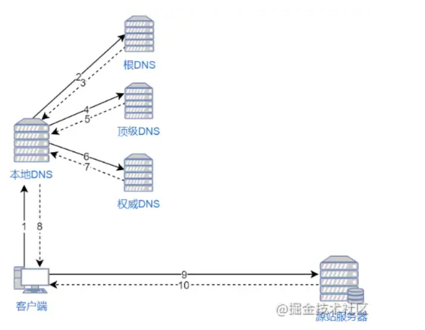
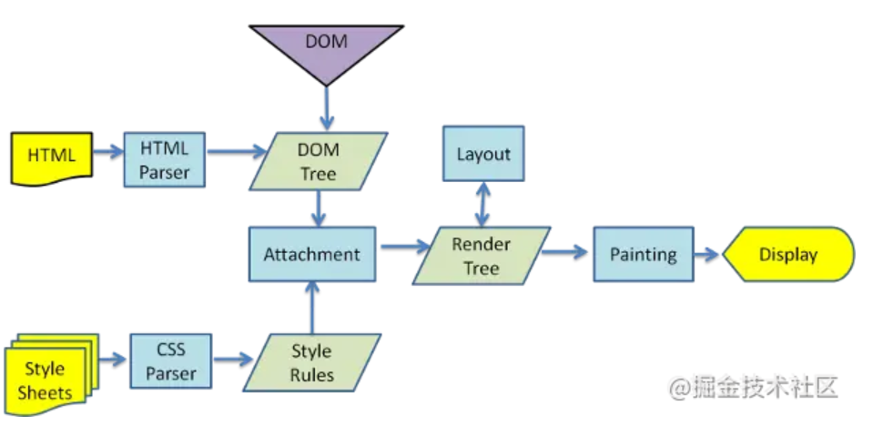

# 性能优化专题

## 缓存

当使用浏览器的后退按钮时会发现页面加载速度特别快，这就是浏览器缓存的力量。

### 什么是缓存

> 当我们在第一次访问网站时，浏览器会把该网站的图片数据下载到电脑上，如果我们再次访问该网站，浏览器就直接从本地读取资源而不是再次去服务器请求，这就是浏览器缓存。

### 缓存的好处

+ 减轻服务器的压力，不用每次都去服务器读取。
+ 提升性能，从本地读取资源比去服务器请求快的多。
+ 减少带宽消耗，当我们使用缓存时，只会产生很小的网络消耗，至于为什么打开本地资源也会产生网络消耗，下面会有说明。

### web缓存的类型

> 缓存类型主要有：数据库缓存、CDN缓存、代理服务器缓存、浏览器缓存。前端主要关注浏览器缓存。

### 浏览器缓存

> 缓存分为强缓存和协商缓存，强缓存不过服务器，协商缓存需要过服务器。协商缓存返回的状态码是304。两类缓存机制可以同时存在，强缓存的优先级强于协商缓存。当执行强缓存时，如果缓存命中，则直接使用缓存中的数据，不再进行缓存协商。

> 缓存位置一般有四个：Service worker, memory cache, disk cache, push catch

#### 强缓存

强缓存是指当浏览器访问url时，不会向服务器发送请求，直接使用缓存中的数据，而且响应状态码是200。

我们第一次进入页面，请求服务器，然后服务器进行应答，浏览器会根据response Header来判断是否对资源进行缓存，如果响应头中expires、pragma或者cache-control字段，代表这是强缓存，浏览器就会把资源缓存在memory cache 或 disk cache中。

1. Expires(HTTP1.0)：Exprires的值为服务端返回的数据到期时间。当再次请求时的请求时间小于返回的此时间，则直接使用缓存数据。但由于服务端时间和客户端时间可能有误差，这也将导致缓存命中的误差。另一方面，Expires是HTTP1.0的产物，故现在大多数使用Cache-Control替代。
`Expires响应头的缺点是使用绝对时间，如果服务器与客户端时间不一致，那么就导致缓存命中偏差。`

2. pragma(HTTP1.0)：HTTP1.0时的遗留字段，当值为"no-cache"时强制验证缓存，它与Cache-Control=no-cache效果一样。pragma禁用缓存，如果pragma=no-cache与expires时间之内同时存在，则pragma优先级更高。服务端如果添加响应头pragma:no-cache会与浏览器f5刷新差不多。

3. Cache-Control(HTTP1.1)：有很多属性，不同的属性代表的意义也不同：
+ private：客户端可以缓存，缓存服务器会对该特定用户提供资源缓存的服务，对于其他用户发送过来的请求，代理服务器则不会返回缓存。
+ public：客户端和代理服务器都可以缓存
+ max-age=t：缓存将在t秒后失效。当首部字段 Cache-Control 有指定 max-age 指令时，比起首部字段 Expires，会优先处理 max-age 指令。
+ **no-cache：使用协商缓存来验证缓存有效性**
+ no-store：所有内容都不进行缓存

请注意no-cache指令很多人误以为是不缓存，这是不准确的，no-cache的意思是可以缓存，但每次用应该去想服务器验证缓存是否可用。no-store才是不缓存内容。当在首部字段Cache-Control 有指定 max-age 指令时，比起首部字段 Expires，会优先处理 max-age 指令。Cache-Control使用了max-age相对时间，解决了expires的问题。

#### 协商缓存

浏览器第一次请求数据时，服务器会将缓存标识与数据一起响应给客户端，客户端将它们备份至缓存中。再次请求时，客户端会将缓存中的标识发送给服务器，服务器根据此标识判断。若未失效，返回304状态码，浏览器拿到此状态码就可以直接使用缓存数据了。

如何设置协商缓存？

**使用Last-Modified / If-Modified-Since缓存标识**

Last-Modified是服务器响应请求时，返回该资源文件在服务器最后被修改的时间。
If-Modified-Since则是客户端再次发起该请求时，携带上次请求返回的Last-Modified值，通过此字段值告诉服务器该资源上次请求返回的最后被修改时间。
服务器收到该请求，发现请求头含有If-Modified-Since字段，则会根据If-Modified-Since的字段值与该资源在服务器的最后被修改时间做对比，若服务器的资源最后被修改时间大于If-Modified-Since的字段值，则重新返回资源，状态码为200；否则则返回304，代表资源无更新，可继续使用缓存文件。

**使用Etag/If-Match/If-Non-Match**

Etag：服务器响应请求时，通过此字段告诉浏览器当前资源在服务器生成的唯一标识（生成规则由服务器决定）
If-Match：条件请求，携带上一次请求中资源的ETag，服务器根据这个字段判断文件是否有新的修改
If-None-Match：再次请求服务器时，浏览器的请求报文头部会包含此字段，后面的值为在缓存中获取的标识。服务器接收到次报文后发现If-None-Match则与被请求资源的唯一标识进行对比。

但是实际应用中由于Etag的计算是使用算法来得出的，而算法会占用服务端计算的资源，所有服务端的资源都是宝贵的，所以就很少使用Etag了。

+ 浏览器地址栏中写入URL，回车浏览器发现缓存中有这个文件了，不用继续请求了，直接去缓存拿（最快）
+ F5就是告诉浏览器，别偷懒，好歹去服务器看看这个文件是否有过期了。于是浏览器就胆胆襟襟的发送一个请求带上If-Modify-since
+ Ctrl+F5告诉浏览器，你先把你缓存中的这个文件给我删了，然后再去服务器请求个完整的资源文件下来。于是客户端就完成了强行更新的操作

### 缓存方案

对于某些不需要缓存的资源，可以使用 Cache-control: no-store ，表示该资源不需要缓存
对于频繁变动的资源，可以使用 Cache-Control: no-cache 并配合 ETag 使用，表示该资源已被缓存，但是每次都会发送请求询问资源是否更新
对于代码文件来说，通常使用 Cache-Control: max-age=31536000（一年） 并配合策略缓存使用，然后对文件进行指纹处理，一旦文件名变动就会立刻下载新的文件

目前大多采用这种缓存方案
html:协商缓存
css,image,js: 强缓存，文件名带hash值

**[强缓存与协商缓存总结(https://www.jianshu.com/p/9c95db596df5/)


## 性能优化

### 使用服务端渲染

>客户端渲染: 获取 HTML 文件，根据需要下载 JavaScript 文件，运行文件，生成 DOM，再渲染。

>服务端渲染：服务端返回 HTML 文件，客户端直接解析 HTML。

服务端渲染的优点：
+ 首屏渲染快
+ 对SEO友好

缺点是配置麻烦，增加了服务器的计算压力。

### 减少 HTTP 请求

一个完整的 HTTP 请求需要经历 DNS 查找，TCP 握手，浏览器发出 HTTP 请求，服务器接收请求，服务器处理请求并发回响应，浏览器接收响应等过程。

建议将多个小文件合并为一个大文件，从而减少 HTTP 请求次数。

### 静态资源使用 CDN

内容分发网络（CDN）是一组分布在多个不同地理位置的 Web 服务器。我们都知道，当服务器离用户越远时，延迟越高。CDN 就是为了解决这一问题，在多个位置部署服务器，让用户离服务器更近，从而缩短请求时间。

#### CDN原理

不使用CDN时，访问网站流程如下：
1. 浏览器要将域名转换成ip进行访问，要向本地DNS发出请求。
2. 本地DNS没有缓存记录，则向依次向根服务器、顶级服务器、权威服务器发出请求，得到网站服务器的IP地址。
3. 本地DNS服务器将IP地址发回给浏览器，浏览器向ip地址发出请求并得到资源。


使用CDN时，访问网站流程如下：
1. 浏览器要将域名解析为 IP 地址，所以需要向本地 DNS 发出请求。
2. 本地 DNS 依次向根服务器、顶级域名服务器、权限服务器发出请求，得到全局负载均衡系统（GSLB）的 IP 地址。
3. 本地DNS在向全局负载均衡系统发出请求，GSLB能够根据本地CDN的ip地址判断用户位置，然后筛选出距离用户较近的本地负载均衡系统（SLB）并发送给本地DNS。
4. 本地DNS将返回的slb的ip地址返回给浏览器，浏览器向slb发出请求。
5. slb根据请求的资源和地址，再选出最优的缓存服务器发给浏览器。
6. 浏览器再根据slb发回的地址重定向到缓存服务器。
7. 如果缓存服务器有对应的资源，则直接发送给浏览器，如果没有，就向源服务器请求资源，再发送浏览器并保存在本地。


### 将 CSS 放在文件头部，JavaScript 文件放在底部

+ CSS 执行会阻塞渲染，阻止 JS 执行
+ JS 加载和执行会阻塞 HTML 解析，阻止 CSSOM 构建

如果这些 CSS、JS 标签放在 HEAD 标签里，并且需要加载和解析很久的话，那么页面就空白了。所以 JS 文件要放在底部（不阻止 DOM 解析，但会阻塞渲染），等 HTML 解析完了再加载 JS 文件，尽早向用户呈现页面的内容。

那为什么 CSS 文件还要放在头部呢？

因为先加载 HTML 再加载 CSS，会让用户第一时间看到的页面是没有样式的、“丑陋”的，为了避免这种情况发生，就要将 CSS 文件放在头部了。

另外，JS 文件也不是不可以放在头部，只要给 script 标签加上 defer 属性就可以了，异步下载，延迟执行。

### 使用缓存，不重复加载相同的资源

为了避免用户每次访问网站都得请求文件，我们可以通过添加 Expires 或 Cache-Control:max-age=t 来控制这一行为。Expires 设置了一个时间，只要在这个时间之前，浏览器都不会请求文件，而是直接使用缓存。而 max-age 是一个相对时间，建议使用 max-age 代替 Expires 。

不过这样会产生一个问题，当文件更新了怎么办？怎么通知浏览器重新请求文件？

可以通过更新页面中引用的资源链接地址，让浏览器主动放弃缓存，加载新资源。

### 压缩文件

压缩文件可以减少文件下载时间，让用户体验性更好。

在 webpack 可以使用如下插件进行压缩：
+ JavaScript：UglifyPlugin
+ CSS ：MiniCssExtractPlugin
+ HTML：HtmlWebpackPlugin

其实，我们还可以做得更好。那就是使用 gzip 压缩。具体做法是：通过向 HTTP 请求头中的 Accept-Encoding 头添加 gzip 标识来开启这一功能。当然，服务器也得支持这一功能。

webpack配置开启gzip
```js
const CompressionPlugin = require('compression-webpack-plugin');//当然要先 yarn add -D

module.exports = {
  plugins: [new CompressionPlugin()],
}
```

### 图片延迟加载

在页面中，先不给图片设置路径，只有当图片出现在浏览器的可视区域时，才去加载真正的图片，这就是延迟加载。对于图片很多的网站来说，一次性加载全部图片，会对用户体验造成很大的影响，所以需要使用图片延迟加载。

首先可以将图片这样设置，在页面不可见时图片不会加载：
```

```

等页面可见时，使用 JS 加载图片:
```js
const img = document.querySelector('img')
img.src = img.dataset.src
```
如何判断一个元素出现在视野中？
element.getBoundingClientRect()可以拿到元素距离显示窗口上下左右的值，当top值正好等于document.documentElement.clientHeight时，说明该元素马上出现在浏览器视口中。
```js
    const offset = document.querySelector('#').getBoundingClientRect();
    if (offset.top === document.documentElement.clientHeight) {
        // 说明元素在视口下方，即将进入视口
    }
```

>document.documentElement.clientHeight是屏幕可视区域的高度，不包括滚动条跟工具条的高度。而window.innerHeight获得的是可视区域的高度，同时包括横向滚动条的高度。

### 通过 webpack 按需加载代码，提取第三库代码，减少 ES6 转为 ES5 的冗余代码

+ 根据文件内容生成文件名，结合 import 动态引入组件实现按需加载：通过配置 output 的 filename 属性可以实现这个需求。filename 属性的值选项中有一个 [contenthash]，它将根据文件内容创建出唯一 hash。当文件内容发生变化时，[contenthash] 也会发生变化。
+ 提取第三方库：由于引入的第三方库一般都比较稳定，不会经常改变。所以将它们单独提取出来，作为长期缓存是一个更好的选择。 这里需要使用 webpack4 的 splitChunk 插件 cacheGroups 选项。
```js
optimization: {
  	runtimeChunk: {
        name: 'manifest' // 将 webpack 的 runtime 代码拆分为一个单独的 chunk。
    },
    splitChunks: {
        cacheGroups: {
            vendor: {
                name: 'chunk-vendors',
                test: /[\\/]node_modules[\\/]/,
                priority: -10,
                chunks: 'initial'
            },
            common: {
                name: 'chunk-common',
                minChunks: 2,
                priority: -20,
                chunks: 'initial',
                reuseExistingChunk: true
            }
        },
    }
},
```

### 减少重绘重排
#### 浏览器渲染过程:
1. 解析html生成DOM树
2. 解析css生成cssom规则树
3. 解析js，操作DOM树和CSSOM规则树
4. 将DOM树和CSSOM树合并在一起生成渲染树
5. 遍历渲染树，计算每一个节点的位置大小信息
6. 浏览器将所有图层的数据发送给GPU，GPU将图层合成显示到屏幕上


#### 重排
>当改变 DOM 元素位置或大小时，会导致浏览器重新生成渲染树，这个过程叫重排。

#### 重绘
>当重新生成渲染树后，就要将渲染树的每个节点绘制到屏幕上，这个过程叫重绘。
**不是所有的动作都会导致重排，例如改变字体颜色，只会导致重绘。记住，重排会导致重绘，重绘不会导致重排。**

重排和重绘这两个操作都是非常昂贵的，因为 JavaScript 引擎线程与 GUI 渲染线程是互斥，它们同时只能一个在工作。

什么操作会引起重排重绘？
+ 添加或删除dom元素
+ 元素位置改变
+ 元素尺寸改变
+ 内容改变
+ 浏览器窗口改变

如何减少重排重绘？
+ 用js改变元素样式时，最好不要直接写样式，而是用替换class的方式实现
+ 如果要对 DOM 元素执行一系列操作，可以将 DOM 元素脱离文档流，修改完成后，再将它带回文档。推荐使用隐藏元素（display:none）或文档碎片（DocumentFragement），都能很好的实现这个方案。

### Web Worker/Service Worker

