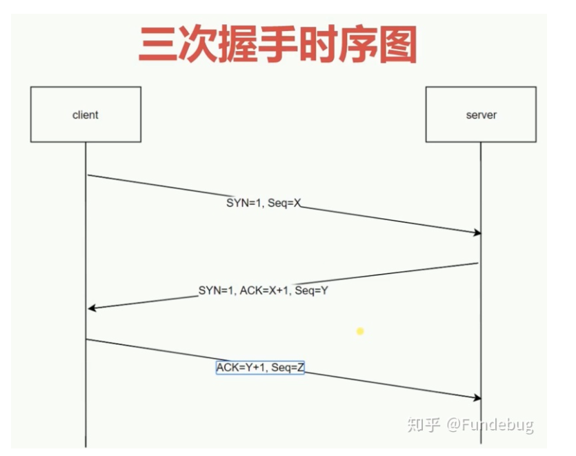
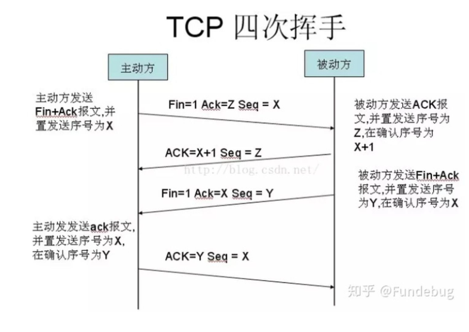

## 从输入URL到页面呈现发生了什么？

### 网络请求
#### 1.构建请求
浏览器会构建请求行:
`GET / http/1.1`
#### 2.查找强缓存
先检查强缓存，如果命中直接使用，否则进入下一步。

#### 3.DNS解析
由于我们输入的是域名，而数据包是通过IP地址传给对方的。因此我们需要得到域名对应的IP地址。这个过程需要依赖一个服务系统，这个系统将域名和 IP 一一映射，我们将这个系统就叫做DNS（域名系统）。得到具体 IP 的过程就是DNS解析。
当然，值得注意的是，浏览器提供了DNS数据缓存功能。即如果一个域名已经解析过，那会把解析的结果缓存下来，下次处理直接走缓存，不需要经过 DNS解析。
另外，如果不指定端口的话，默认采用对应 IP 的 80 端口。

>需要注意的是DNS解析时还要考虑目标网站是否使用了CDN(内容分发网络)技术，此处参考性能优化篇的CDN章节。
#### 4.建立TCP连接
> TCP（Transmission Control Protocol，传输控制协议）是一种面向连接的、可靠的、基于字节流的传输层通信协议。

+ 通过三次握手(即总共发送3个数据包确认已经建立连接)建立客户端和服务器之间的连接。
+ 进行数据传输。这里有一个重要的机制，就是接收方接收到数据包后必须要向发送方确认, 如果发送方没有接到这个确认的消息，就判定为数据包丢失，并重新发送该数据包。当然，发送的过程中还有一个优化策略，就是把大的数据包拆成一个个小包，依次传输到接收方，接收方按照这个小包的顺序把它们组装成完整数据包。
+ 断开连接的阶段。数据传输完成，现在要断开连接了，通过四次挥手来断开连接。

可见，TCP 连接是通过什么手段来保证数据传输的可靠性，一是三次握手确认连接，二是数据包校验保证数据到达接收方，三是通过四次挥手断开连接。
#### 5.发送 HTTP 请求
TCP连接建立完毕，浏览器可以和服务器开始通信，即开始发送 HTTP 请求。浏览器发 HTTP 请求要携带三样东西:**请求行、请求头和请求体**。

注意：请求体只有在POST方法下存在，GET请求的请求参数存在于请求行的请求URL中。
#### 6.服务器处理请求并返回 HTTP 报文
跟请求部分类似，网络响应具有三个部分:响应行、响应头和响应体。
响应行如下：
`http/1.1 200 ok`

从HTTP/1.1起，浏览器默认都开启了connection:Keep-Alive请求头，保持连接特性，客户端和服务器都能选择随时关闭连接，则请求头中为connection:close。简单地说，当一个网页打开完成后，客户端和服务器之间用于传输HTTP数据的TCP连接不会关闭，如果客户端再次访问这个服务器上的网页，会继续使用这一条已经建立的TCP连接。但是Keep-Alive不会永久保持连接，它有一个保持时间，可以在不同的服务器软件（如Apache）中设定这个时间。

#### 7.浏览器解析渲染页面

浏览器解析渲染页面分为一下五个步骤：
+ 根据 HTML 解析出 DOM 树
+ 根据 CSS 解析生成 CSS 规则树
+ 结合 DOM 树和 CSS 规则树，生成渲染树
+ 根据渲染树计算每一个节点的信息
+ 根据计算好的信息绘制页面

##### 根据 HTML 解析 DOM 树

+ 根据 HTML 的内容，将标签按照结构解析成为 DOM 树，DOM 树解析的过程是一个深度优先遍历。即先构建当前节点的所有子节点，再构建下一个兄弟节点。
+ 在读取 HTML 文档，构建 DOM 树的过程中，若遇到 script 标签，则 DOM 树的构建会暂停，直至脚本执行完毕。

##### 根据 CSS 解析生成 CSS 规则树

+ 解析 CSS 规则树时 js 执行将暂停，直至 CSS 规则树就绪。
+ 浏览器在 CSS 规则树生成之前不会进行渲染。

##### 结合 DOM 树和 CSS 规则树，生成渲染树

- DOM 树和 CSS 规则树全部准备好了以后，浏览器才会开始构建渲染树。
- 精简 CSS 并可以加快 CSS 规则树的构建，从而加快页面相应速度。

##### 根据渲染树计算每一个节点的信息（布局）

- 布局：通过渲染树中渲染对象的信息，计算出每一个渲染对象的位置和尺寸
- 回流：在布局完成后，发现了某个部分发生了变化影响了布局，那就需要倒回去重新渲染。

##### 根据计算好的信息绘制页面

+ 绘制阶段，系统会遍历呈现树，并调用呈现器的“paint”方法，将呈现器的内容显示在屏幕上。
+ 重绘：某个元素的背景颜色，文字颜色等，不影响元素周围或内部布局的属性，将只会引起浏览器的重绘。
+ 回流：某个元素的尺寸发生了变化，则需重新计算渲染树，重新渲染。

#### 断开TCP连接

当数据传送完毕，需要断开 tcp 连接，此时发起 tcp 四次挥手。

## 三次握手与四次挥手

#### 三次握手

TCP 三次握手的过程如下：
- 客户端发送一个带 SYN=1，Seq=X 的数据包到服务器端口（第一次握手，由浏览器发起，告诉服务器我要发送请求了）
- 服务器发回一个带 SYN=1， ACK=X+1， Seq=Y 的响应包以示传达确认信息（第二次握手，由服务器发起，告诉浏览器我准备接受了，你赶紧发送吧）
- 客户端再回传一个带 ACK=Y+1， Seq=Z 的数据包，代表“握手结束”（第三次握手，由浏览器发送，告诉服务器，我马上就发了，准备接受吧）

为啥需要三次握手？
两者都确认彼此的发送和接收能力。

为什么要3次握手而不是2次？
“为了防止已失效的连接请求报文段突然又传送到了服务端，因而产生错误”。

#### 四次挥手

- 发起方向被动方发送报文，Fin、Ack、Seq，表示已经没有数据传输了。并进入 FIN_WAIT_1 状态。(第一次挥手：由浏览器发起的，发送给服务器，我请求报文发送完了，你准备关闭吧)
- 被动方发送报文，Ack、Seq，表示同意关闭请求。此时主机发起方进入 FIN_WAIT_2 状态。(第二次挥手：由服务器发起的，告诉浏览器，我请求报文接受完了，我准备关闭了，你也准备吧)
- 被动方向发起方发送报文段，Fin、Ack、Seq，请求关闭连接。并进入 LAST_ACK 状态。(第三次挥手：由服务器发起，告诉浏览器，我响应报文发送完了，你准备关闭吧)
- 发起方向被动方发送报文段，Ack、Seq。然后进入等待 TIME_WAIT 状态。被动方收到发起方的报文段以后关闭连接。发起方等待一定时间未收到回复，则正常关闭。(第四次挥手：由浏览器发起，告诉服务器，我响应报文接受完了，我准备关闭了，你也准备吧)