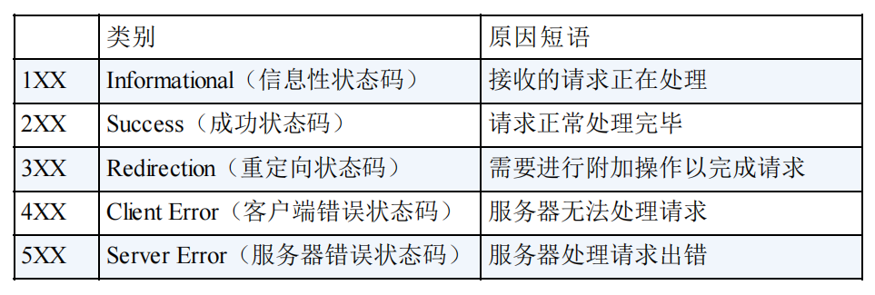
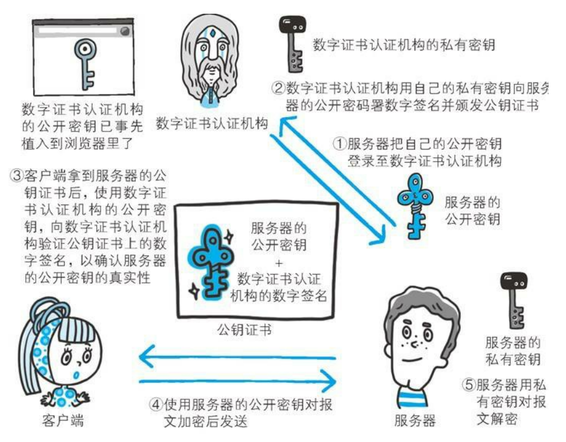

# 网络

## HTTP

### HTTP/1.1的方法

+ GET：获取资源
+ POST：传输实体主体。就是说POST请求是想告诉服务器某条信息，比如增删改，其目的不在获取响应的内容。
+ PUT：传输文件。鉴于 HTTP/1.1 的 PUT 方法自身不带验证机制，任何人都可以 上传文件 , 存在安全性问题，因此一般的 Web 网站不使用该方法。
+ HEAD：只返回响应头，不携带主体。
+ OPTIONS：

### 响应状态码

#### 1XX
+ 101:Switching Protocols，HTTP升级为WebSocket时的响应码就是101。

#### 2XX
2XX 的响应结果表明请求被正常处理了。
+ 200
+ 204：No Content
+ 206：Partial Content。对应请求头Range，响应头Content-Range。

#### 3XX
3XX 响应结果表明浏览器需要执行某些特殊的处理以正确处理请求。
+ 301：Removed Permanently，永久性重定向。该状态码表示请求的资源已被分配了新的 URI，以后应使用资源现在所指的 URI。在请求的URL已被移除时使用，响应的Location首部中应包含资源现在所处的URL。
+ 302：Found，临时性重定向。
+ 304：Not Modified，缓存有效，从缓存读取资源。相关请求头：Last-Modified/If-Modified-Since,Etag/If-None-Match.

#### 4XX
4XX 的响应结果表明客户端是发生错误的原因所在。
+ 400：Bad Request。该状态码表示请求报文中存在语法错误。
+ 401：Unauthorized。需认证。
+ 403：Forbidden。无权限。
+ 404：Not Found。

#### 5XX
5XX 的响应结果表明服务器本身发生错误。
+ 500: Internal Server Error
+ 503：Service Unavailable。该状态码表明服务器暂时处于超负载或正在进行停机维护，现在无法处理请求。

### HTTP首部

+ 端到端首部：经过代理或缓存服务器后仍需要携带到最终目标服务器的首部字段。
+ 逐跳首部：经过代理或缓存后不需要继续携带的首部字段。分在此类别中的首部只对单次转发有效，会因通过缓存或代理而不再转发。HTTP/1.1 和之后版本中，如果要使用 hop-by-hop 首部，需提 供 Connection 首部字段。
>八个逐跳首部：Connection、Keep-Alive、Proxy-Authenticate、Proxy-Authorization、Trailer、TE、Transfer-Encoding、Upgrade。其余首部皆为端到端首部。

Connection 首部字段具备如下两个作用：
1. 控制不再转发给代理的首部字段
2. 管理持久连接：HTTP/1.1 版本的默认连接都是持久连接(Connection: Keep-Alive)。为此，客户端会在持 久连接上连续发送请求。当服务器端想明确断开连接时，则指定 Connection 首部字段的值为 Close。

### HTTPS
(Hyper Text Transfer Protocol over SecureSocket Layer)
>HTTP+ 加密 + 认证 + 完整性保护 =HTTPS。HTTPS 是身披 SSL 外壳的 HTTP。
通常，HTTP 直接和 TCP 通信。当使用 SSL时，则演变成先和 SSL通 信，再由 SSL和 TCP 通信了。简言之，所谓 HTTPS，其实就是身披 SSL协议这层外壳的 HTTP。

#### HTTP与HTTPS的不同

1. http是超文本传输协议，信息是明文传输。https是具有安全性的ssl加密传输协议，能防止数据在传输过程中被窃取、篡改，确保数据完整性。
2. 端口号不一样。80、8443
3. http的连接过程相对简单，只经过三次握手；https握手比较复杂（12次），会使通信时长延长50%以上。
4. https协议需要ca证书，费用较高
5. ssl证书需要绑定ip，不能在一个ip上绑定多个https域名

#### HTTPS的工作原理

客户端在使用 HTTPS 方式与 Web 服务器通信时有以下几个步骤：

1. 客户端使用 https url 访问服务器，则要求 web 服务器建立 ssl 链接。
2. web 服务器接收到客户端的请求之后，会将网站的证书（证书中包含了公钥），传输给客户端。
3. 客户端和服务器端协商ssl链接安全等级
4. 客户端生成安全密钥，用公钥加密发送至服务器
5. 服务器通过私钥解密出会话密钥，并通过会话密钥加密与客户端之间的通信

## 三次握手与四次挥手

### TCP的相关基础知识

位码:即tcp标志位，有6种标示：
- SYN(synchronous建立联机) 
- ACK(acknowledgement 确认) 
- PSH(push传送) 
- FIN(finish结束) 
- RST(reset重置) 
- URG(urgent紧急)

Sequence number(顺序号码) 
Acknowledge number(确认号码)

#### 三次握手

TCP 三次握手的过程如下：
- 主机A发送位码为SYN＝1，随机产生seq number=1234567的数据包到服务器，主机B由SYN=1知道，A要求建立联机；
- 主机B收到请求后要确认联机信息，向A发送ack number=(主机A的seq+1)，SYN=1，ACK=1，随机产生seq=7654321的包；
- 主机A收到后检查ack number是否正确，即第一次发送的seq number+1，以及位码ACK是否为1，若正确，主机A会再发送ack number=(主机B的seq+1)，ACK=1，主机B收到后确认seq值与ack=1则连接建立成功。

为啥需要三次握手？
两者都确认彼此的发送和接收能力。

为什么要3次握手而不是2次？
“为了防止已失效的连接请求报文段突然又传送到了服务端，因而产生错误”。

#### 四次挥手

- 发起方向被动方发送报文，Fin、Ack、Seq，表示已经没有数据传输了。并进入 FIN_WAIT_1 状态。(第一次挥手：由浏览器发起的，发送给服务器，我请求报文发送完了，你准备关闭吧)
- 被动方发送报文，Ack、Seq，表示同意关闭请求。此时主机发起方进入 FIN_WAIT_2 状态。(第二次挥手：由服务器发起的，告诉浏览器，我请求报文接受完了，我准备关闭了，你也准备吧)
- 被动方向发起方发送报文段，Fin、Ack、Seq，请求关闭连接。并进入 LAST_ACK 状态。(第三次挥手：由服务器发起，告诉浏览器，我响应报文发送完了，你准备关闭吧)
- 发起方向被动方发送报文段，Ack、Seq。然后进入等待 TIME_WAIT 状态。被动方收到发起方的报文段以后关闭连接。发起方等待一定时间未收到回复，则正常关闭。(第四次挥手：由浏览器发起，告诉服务器，我响应报文接受完了，我准备关闭了，你也准备吧)

## TCP和UDP的区别

- TCP是面向链接的，而UDP是面向无连接的。
- TCP仅支持单播传输，UDP 提供了单播，多播，广播的功能。
- TCP的三次握手保证了连接的可靠性; UDP是无连接的、不可靠的一种数据传输协议，首先不可靠性体现在无连接上，通信都不需要建立连接，对接收到的数据也不发送确认信号，发送端不知道数据是否会正确接收。
- UDP的头部开销比TCP的更小，数据传输速率更高，实时性更好。
